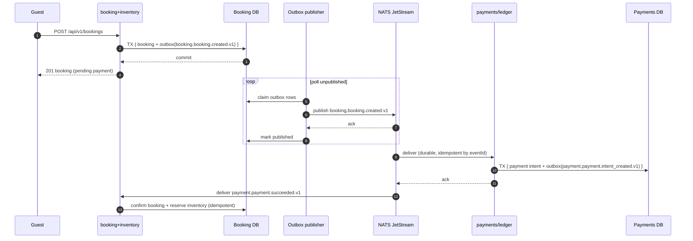

# Booking → Payment Saga

The critical path for the coupled transactional core (`booking + inventory`
and `payments`). It uses a per-service transactional outbox so domain data and
the event that announces it commit atomically, and every consumer is idempotent
by `eventId`.

## Why this shape

- **Outbox, not direct publish.** A publish that happens outside the DB
  transaction can be lost (or a rollback can leave a phantom event). Writing the
  event in the same transaction and forwarding it afterward gives
  at-least-once delivery with a replayable source of truth.
- **Idempotent consumers.** Duplicate-key inserts count as success; consumers
  ack only after processing and use `eventId` (or a domain key) to dedupe.
- **No cross-service writes.** Payment never updates booking rows; it emits an
  event and booking applies it. This is what lets the two be extracted
  independently.
- **Durable consumers + dead-letter.** Poison messages go to a dead-letter
  subject after max deliveries; processing is observable.

This design is the prerequisite for steps 6 and 7 of
`plan/service_extraction_order.md`.
