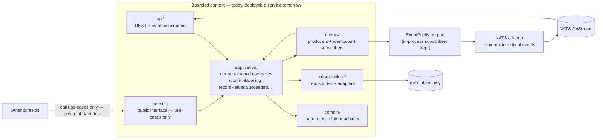

# Bounded Context

The internal shape every module (today) and service (tomorrow) shares. The same
layout already exists under `server/modules/<name>/`; this is the rule set it
must satisfy when the refactor is finished.

## Rules

- `api/` and `events/` are the only inbound edges; `index.js` is the only
  outbound edge.
- `application/` owns orchestration; `domain/` is pure and has no I/O.
- `infrastructure/` is the only layer allowed to touch the ORM, and only the
  context's own tables.
- Cross-context access is a use-case call (or a domain event), never a deep
  import and never a query into another context's tables.
- In-process subscribers stay; events additionally publish through the
  `EventPublisher` port so remote services can consume them.
