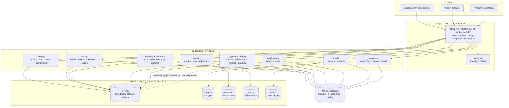

# System Topology

Gateway, services, event backbone and the data stores each context owns.

## Notes

- The gateway preserves `/api/v1/*` response shapes during migration; it
  proxies route groups to services as they reach parity and enriches responses
  (e.g. analytics returns hotel IDs, the gateway loads hotel cards).
- Dotted edges are read-only and documented in `wiki/Table-Ownership.md`;
  they are transitional and disappear once each service owns its projections.
- `services/{analytics,media,notification}` already exist in this repo.
