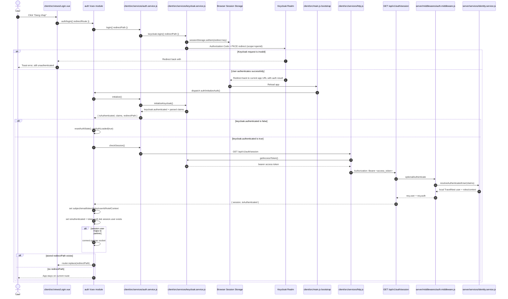

# Login Flow (Current)

```mermaid
sequenceDiagram
    autonumber
    actor User
    participant LoginPage as client/src/views/Login.vue
    participant Vuex as auth Vuex module
    participant AuthService as client/src/services/auth.service.js
    participant KCAdapter as client/src/services/keycloak.service.js
    participant Browser as Browser Session Storage
    participant Keycloak as Keycloak Realm
    participant AppBoot as client/src/main.js bootstrap
    participant Http as client/src/services/http.js
    participant API as GET /api/v1/auth/session
    participant AuthMW as server/middlewares/auth.middleware.js
    participant Identity as server/services/identity.service.js

    User->>LoginPage: Click "Dang nhap"
    LoginPage->>Vuex: auth/login({ redirectRoute })
    Vuex->>AuthService: login({ redirectPath })
    AuthService->>KCAdapter: keycloak.login({ redirectPath })
    KCAdapter->>Browser: sessionStorage.setItem(redirect key)
    KCAdapter->>Keycloak: Authorization Code + PKCE redirect (scope=openid)

    alt Keycloak request is invalid
        Keycloak-->>LoginPage: Redirect back with #error=invalid_scope or similar
        LoginPage-->>User: Toast error, still unauthenticated
    else User authenticates successfully
        Keycloak-->>Browser: Redirect back to current app URL with auth result
        Browser->>AppBoot: Reload app
        AppBoot->>Vuex: dispatch auth/initializeAuth()
        Vuex->>AuthService: initialize()
        AuthService->>KCAdapter: initializeKeycloak()
        KCAdapter-->>AuthService: keycloak.authenticated + parsed claims
        AuthService-->>Vuex: { isAuthenticated, claims, redirectPath }

        alt keycloak.authenticated is false
            Vuex->>Vuex: resetAuthState(), setAuthLoaded(true)
        else keycloak.authenticated is true
            Vuex->>AuthService: checkSession()
            AuthService->>Http: GET /api/v1/auth/session
            Http->>KCAdapter: getAccessToken()
            KCAdapter-->>Http: bearer access token
            Http->>API: Authorization: Bearer <access_token>
            API->>AuthMW: optionalAuthenticate
            AuthMW->>Identity: resolveAuthenticatedUser(claims)
            Identity-->>AuthMW: local TravelNest user + roles/context
            AuthMW-->>API: req.user + req.auth
            API-->>Vuex: { session, isAuthenticated }
            Vuex->>Vuex: set subject/email/tokenRoles/userId/hotelContext
            Vuex->>Vuex: set isAuthenticated = token auth && session.user exists

            alt session user maps to partner
                Vuex->>Vuex: connect partner socket
            end

            alt stored redirectPath exists
                Vuex->>LoginPage: router.replace(redirectPath)
            else no redirectPath
                Vuex-->>User: App stays on current route
            end
        end
    end
```
