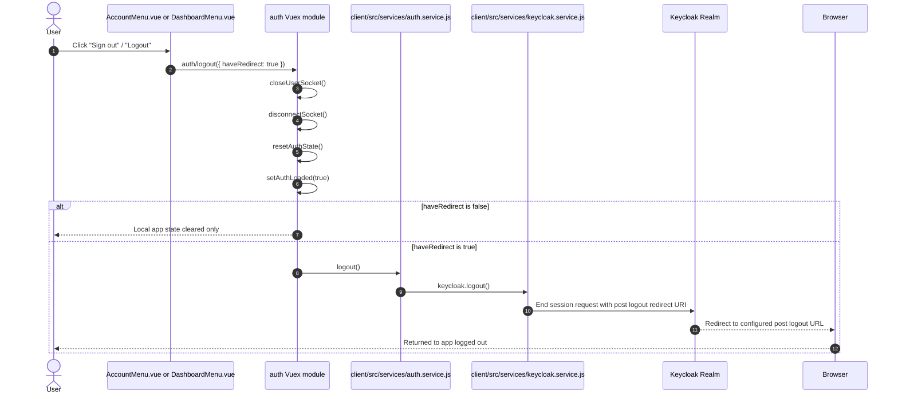

# Logout Flow (Current)

```mermaid
sequenceDiagram
    autonumber
    actor User
    participant Menu as AccountMenu.vue or DashboardMenu.vue
    participant Vuex as auth Vuex module
    participant AuthService as client/src/services/auth.service.js
    participant KCAdapter as client/src/services/keycloak.service.js
    participant Keycloak as Keycloak Realm
    participant Browser as Browser

    User->>Menu: Click "Sign out" / "Logout"
    Menu->>Vuex: auth/logout({ haveRedirect: true })
    Vuex->>Vuex: closeUserSocket()
    Vuex->>Vuex: disconnectSocket()
    Vuex->>Vuex: resetAuthState()
    Vuex->>Vuex: setAuthLoaded(true)

    alt haveRedirect is false
        Vuex-->>User: Local app state cleared only
    else haveRedirect is true
        Vuex->>AuthService: logout()
        AuthService->>KCAdapter: keycloak.logout()
        KCAdapter->>Keycloak: End session request with post logout redirect URI
        Keycloak-->>Browser: Redirect to configured post logout URL
        Browser-->>User: Returned to app logged out
    end
```
