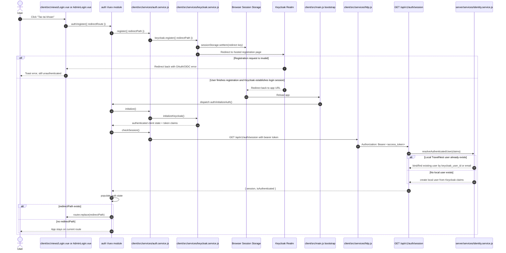

# Register Flow (Current)

```mermaid
sequenceDiagram
    autonumber
    actor User
    participant LoginPage as client/src/views/Login.vue or AdminLogin.vue
    participant Vuex as auth Vuex module
    participant AuthService as client/src/services/auth.service.js
    participant KCAdapter as client/src/services/keycloak.service.js
    participant Browser as Browser Session Storage
    participant Keycloak as Keycloak Realm
    participant AppBoot as client/src/main.js bootstrap
    participant Http as client/src/services/http.js
    participant API as GET /api/v1/auth/session
    participant Identity as server/services/identity.service.js

    User->>LoginPage: Click "Tao tai khoan"
    LoginPage->>Vuex: auth/register({ redirectRoute })
    Vuex->>AuthService: register({ redirectPath })
    AuthService->>KCAdapter: keycloak.register({ redirectPath })
    KCAdapter->>Browser: sessionStorage.setItem(redirect key)
    KCAdapter->>Keycloak: Redirect to hosted registration page

    alt Registration request is invalid
        Keycloak-->>LoginPage: Redirect back with OAuth/OIDC error
        LoginPage-->>User: Toast error, still unauthenticated
    else User finishes registration and Keycloak establishes login session
        Keycloak-->>Browser: Redirect back to app URL
        Browser->>AppBoot: Reload app
        AppBoot->>Vuex: dispatch auth/initializeAuth()
        Vuex->>AuthService: initialize()
        AuthService->>KCAdapter: initializeKeycloak()
        KCAdapter-->>Vuex: authenticated client state + token claims
        Vuex->>AuthService: checkSession()
        AuthService->>Http: GET /api/v1/auth/session with bearer token
        Http->>API: Authorization: Bearer <access_token>
        API->>Identity: resolveAuthenticatedUser(claims)

        alt Local TravelNest user already exists
            Identity-->>API: bind/find existing user by keycloak_user_id or email
        else No local user exists
            Identity-->>API: create local user from Keycloak claims
        end

        API-->>Vuex: { session, isAuthenticated }
        Vuex->>Vuex: populate auth state

        alt redirectPath exists
            Vuex->>LoginPage: router.replace(redirectPath)
        else no redirectPath
            Vuex-->>User: App stays on current route
        end
    end
```
