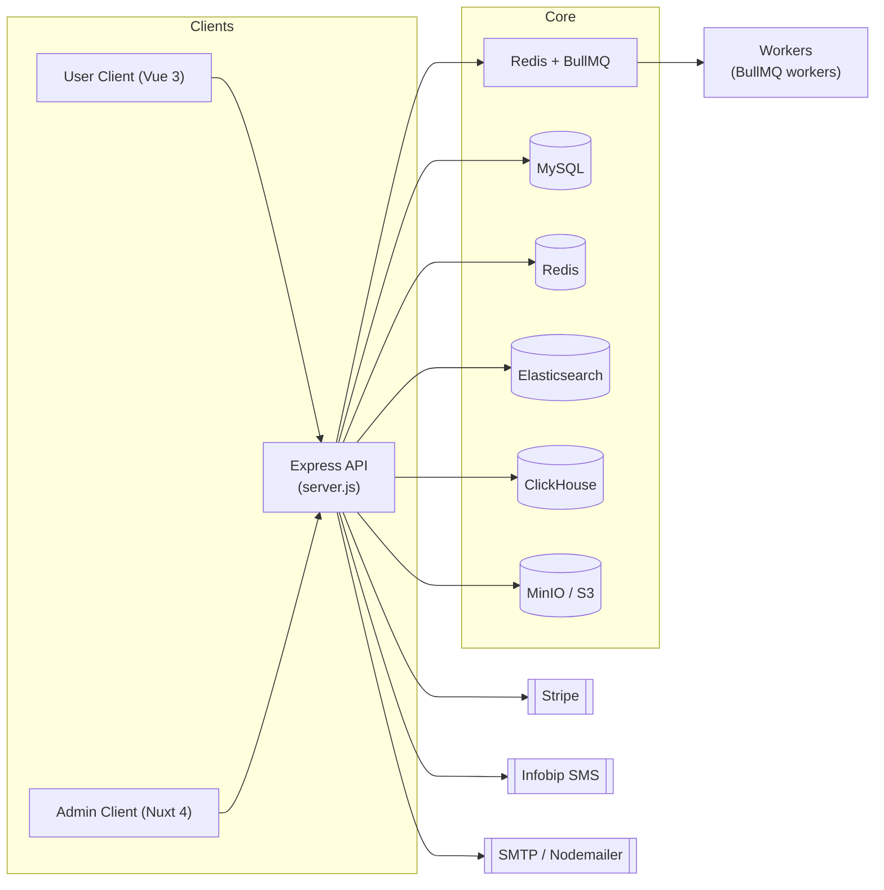

# TravelNest Server (API & Workers)

The TravelNest server is the backend API and background worker layer for the TravelNest hotel booking platform.
It powers search, bookings, reviews, notifications, payments, and analytics for both the user-facing and admin applications.

## Tech Stack

- **Runtime**: Node.js (CommonJS)
- **Framework**: Express.js
- **Database**: MySQL with Sequelize ORM
- **Caching & Queues**:
  - Redis (sessions, caching, rate limiting)
  - BullMQ for background jobs (`email`, `notifications`, analytics, etc.)
- **Search & Analytics**:
  - Elasticsearch for hotel search and log indexing
  - ClickHouse for search and booking analytics
- **Storage**:
  - MinIO / S3-compatible storage for media
  - (Optionally) Cloudinary for image delivery
- **Auth & Security**:
  - Session-based authentication
  - Passport (Google, Twitter, etc.)
  - CSRF protection, rate limiting, validation with Joi
- **Payments & Integrations**:
  - Stripe (payments)
  - Infobip (SMS)
  - Email validation provider
- **Realtime**: Socket.IO (notifications and live updates)
- **Logging**: Pino + structured JSON logs

## Architecture



## Getting Started

### Prerequisites

- Node.js 18+ and npm
- A running MySQL and Redis instance (local Docker is fine for development)
- Optional (but recommended for full feature set):
  - Elasticsearch
  - ClickHouse

### Environment Variables

Create a `.env` file in the `server` directory (or use your preferred env management).
At minimum you will need:

- **Application**
  - `NODE_ENV`
  - `PORT` (default: `3000`)
- **Database**
  - `DB_HOST`, `DB_PORT`, `DB_NAME`, `DB_USER`, `DB_PASSWORD`
- **Redis**
  - `REDIS_HOST`, `REDIS_PORT`, `REDIS_PASSWORD` (if enabled)
- **Sessions & Security**
  - `SESSION_SECRET`, `SESSION_SECRET_KEY`
  - `JWT_SECRET` (if JWT is used anywhere)
- **Storage & Integrations**
  - MinIO / S3 credentials
  - Stripe secret key
  - Email / SMS provider keys

> For production-ready environment variables, see the deploy documentation in `deploy/docs/VPS_SETUP_GUIDE.md` and `deploy/docs/VPS_SETUP_COMPLETE.md`.

### Install Dependencies

```bash
cd server
npm install
```

### Database Setup

Run the initial database setup and seed data for development:

```bash
# Create / migrate schema (via custom init + Sequelize)
npm run db:init
npm run migrate

# Seed core data
npm run seed:all:quick
```

Useful database commands:

- Run all seeds: `npm run seed:all`
- Clear and reseed: `npm run seed:all:clear`
- Run a specific seed, for example:
  - `npm run seed:user`
  - `npm run seed:hotel`
  - `npm run seed:booking`

### Elasticsearch & ClickHouse Setup (Optional for Local Dev)

If you have Elasticsearch and ClickHouse running locally:

```bash
# Hotels search index
npm run es:setup-hotels
npm run es:seed-hotels

# Log index
npm run es:setup-logs

# Initialize ClickHouse analytics schema (requires docker container name from deploy stack)
npm run clickhouse:init
```

These commands are primarily used in production via the deployment scripts; for local development you can skip them if you do not need full‑text search or analytics.

### Run the Server (Development)

```bash
cd server
npm run dev
```

By default the API listens on `http://localhost:3000` (configurable via `PORT`).

### Run the Server (Production)

Most production deployments use Docker via the `deploy` stack, but you can also run directly:

```bash
cd server
npm run start
```

Ensure `NODE_ENV=production` and your production `.env` are configured.

## Testing

The server uses Jest (with Testcontainers for integration tests).

Common test scripts:

- Run all tests: `npm test`
- Watch mode: `npm run test:watch`
- Unit tests only: `npm run test:unit`
- Integration tests: `npm run test:integration`
- Coverage report: `npm run test:coverage`
- CI mode (used in GitHub Actions): `npm run test:ci`

## Linting & Formatting

```bash
# Lint all files
npm run lint

# Auto-fix lint issues
npm run lint:fix

# Format with Prettier
npm run format
```

## Roadmap

- [ ] Expand API documentation with full OpenAPI/Swagger coverage.
- [ ] Add more integration tests for payments, notifications, and analytics.
- [ ] Implement feature flags for gradual rollout of new features.
- [ ] Introduce per-tenant and per-user rate limiting strategies.
- [ ] Improve observability (structured logs, metrics, and tracing across services).
- [ ] Add background jobs for heavy reporting and data exports.

